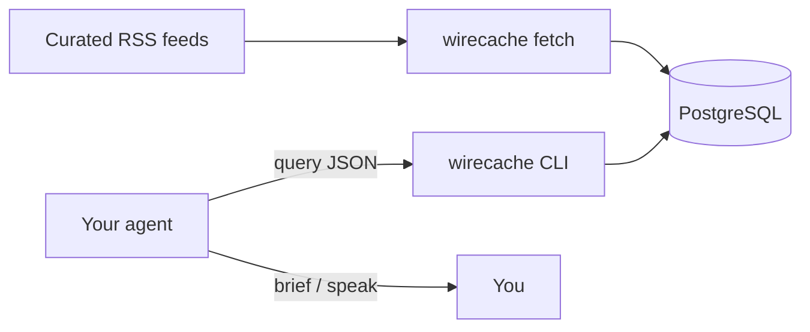
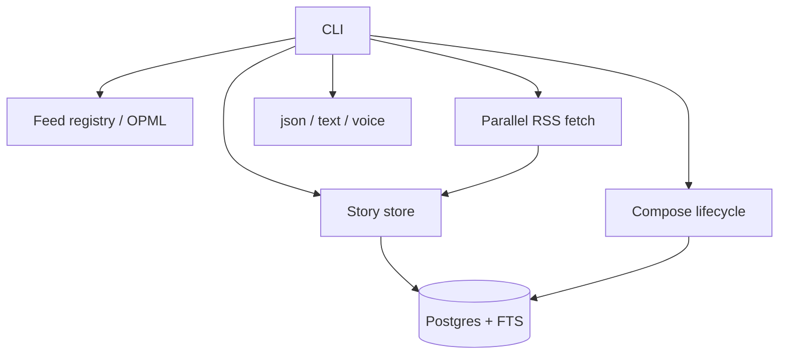

# wirecache

**Stop burning tokens on news you already could have cached.**

Built for people running agents on local iron — [DGX Spark](https://www.nvidia.com/en-us/products/workstations/dgx-spark/), homelab GPUs, always-on boxes — who want headlines and research bites **without** the model wandering the open web for twenty tool calls.

wirecache pulls a curated RSS/Atom wire into PostgreSQL and gives you a tiny CLI. Your agent asks once, gets JSON back, and spends tokens on *judgment* — not rediscovery.

Deterministic plumbing. The LLM owns the briefing (and TTS, if you want it spoken).

## Why this exists

Generic “search the news” is slow, flaky, and expensive in context. A Spark (or any local agent host) is perfect for a **personal newswire cache**: you pick the sources, wirecache keeps them warm, Hermes (or whatever agent you use) queries them.



Physics for poets: **feeds in → cache → ask → answers out.** No crawling safari.

## Quick start

```bash
git clone https://github.com/AdrianBinDC/wirecache.git
cd wirecache
uv sync --extra dev

# First run copies feeds.example.yaml → feeds.yaml and .env.example → .env
uv run wirecache fetch
uv run wirecache query --category ai --limit 10
```

Needs [Docker](https://docs.docker.com/get-docker/) (Postgres via Compose), [uv](https://docs.astral.sh/uv/), Python 3.11+. Postgres starts on the first DB command. Defaults are local-dev only (`news`/`news` on port `5432`).

## Agent-shaped commands

| You want | Run |
|----------|-----|
| Structured data for the model | `uv run wirecache query --category ai --limit 15` |
| Spoken briefing (Hermes TTS) | `uv run wirecache query --category ai --format voice --limit 6` |
| Human scan with links | `uv run wirecache query --category tech --format text` |
| Topic watch | `uv run wirecache query --keyword CUDA --days 3` |
| Fresh then ask | `uv run wirecache query --category ai --fetch-first --limit 10` |
| Health check | `uv run wirecache status` |

Background refresh: `scripts/fetch.sh` (cron / Hermes).

**Formats:** `json` (default, agents), `text` (terminal), `voice` (speakable prose — no URLs/markdown; audio is Hermes’s job).

## Your feeds, your wire

| File | Role |
|------|------|
| `feeds.example.yaml` | Starter set (strong **AI** section: labs, research, digests) |
| `feeds.yaml` | **Yours** — gitignored; created on first run |

```bash
uv run wirecache list-feeds --category ai
uv run wirecache add-feed --url URL --name NAME --categories ai,tech
uv run wirecache import-opml ~/subscriptions.opml --category ai
```

Tag by primary beat: AI-primary → `ai`; general tech stays `tech`. Agent procedures: [SKILL.md](SKILL.md).

## Under the hood



| Change this… | Look here |
|--------------|-----------|
| Feeds / categories | `feeds.yaml`, `src/wirecache/feeds/` |
| Fetch behavior | `src/wirecache/fetch/rss.py` |
| Query / purge / FTS | `src/wirecache/store/stories.py`, `schema.sql` |
| Voice phrasing | `src/wirecache/output/voice_fmt.py` |

## Hermes

Drop this repo where Hermes loads skills (or symlink it). Prefer **wirecache** over open-web news search and over legacy `news` / `news-fetcher` skills. Details in [SKILL.md](SKILL.md).

## Logging

Stdout = command results. Logs → stderr and `data/wirecache.log`.

```bash
uv run wirecache -v fetch
uv run wirecache -q status
```

See `.env.example` for `WIRECACHE_LOG_LEVEL` / `WIRECACHE_LOG_FILE`.

## Dev

```bash
uv sync --extra dev
uv run pytest -q
```

## License

MIT — [LICENSE](LICENSE).
